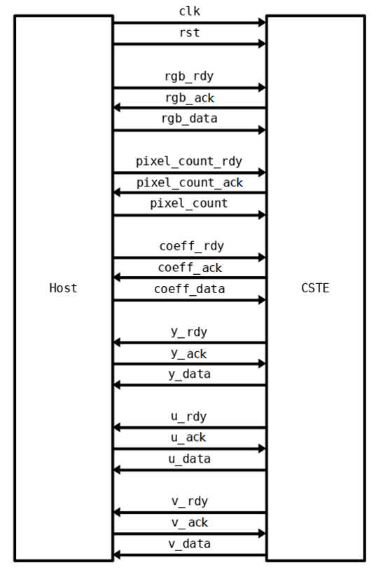
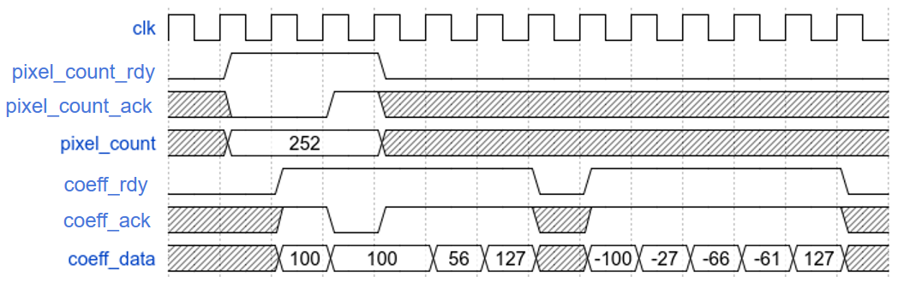

# Color Space Transform Engine

## 問題描述
請完成 Color Space Transform Engine (CSTE) 的電路設計以。此電路可將二維彩色影像訊號，轉換為 YUV 格示輸出，並降低影像水平大小。有關 CSTE 詳細規格將描述於後。

## 輸入輸出介面



* `input clk`
	* 本系統為同步於時脈正緣之同步設計。（註: Host 端採 clk 正緣時送資料。）
* `input rst`
	* 低位準非同步 (active low asynchronous) 之系統重置信號。
* `input rgb_valid`
	* 指示輸入 `rgb_data` 資料為有效之控制訊號。當為 high 時，表示目前輸出的資料為有效的；反之，當為 low 時，表示目前輸出資料為無效的，即不被採用。
* `output rgb_ready`
	* CSTE 可接受資料之控制訊號。當為 low 時，表示系統正處於忙碌階段，告知 host 端暫時停止 `rgb_data` 資料的輸入；反之，當為 high 時，表示告知 Host 端可繼續由 `pixel_in` 輸入資料。
* `input [7:0] rgb_data [3]`
	* CSTE 影像 pixel 訊號之匯流排。Host 端會透過此匯流排將影像的所有 pixel 訊號進行輸入。每一個週期僅能輸入一組 pixel 值，且輸入過的 pixel 值無法再重複輸入。註：輸入訊號之 pixel 結構與其順序，請參照下方章節圖所示。
* `input pixel_count_valid`
	* 指示輸入 `pixel_count` 資料為有效之控制訊號。當為 high 時，表示目前輸出的資料為有效的；反之，當為 low 時，表示目前輸出資料為無效的，即不被採用。
* `output pixel_count_ready`
	* CSTE 可接受資料之控制訊號。當為 low 時，表示系統正處於忙碌階段，告知 host 端暫時停止 `pixel_count` 資料的輸入；反之，當為 high 時，表示告知 Host 端可繼續由 `pixel_in` 輸入資料。
* `input [15:0] pixel_count`
	* CSTE 影像要處理的 pixel 數量訊號之匯流排，告知會有多少 pixel 從 `rgb_data` 輸入。註：此輸入訊號之結構與其順序，請參照下方章節圖所示。
* `input coeff_valid`
	* 指示輸入 `coeff_data` 資料為有效之控制訊號。當為 high 時，表示目前輸出的資料為有效的；反之，當為 low 時，表示目前輸出資料為無效的，即不被採用。
* `output coeff_ready`
	* CSTE 可接受資料之控制訊號。當為 low 時，表示系統正處於忙碌階段，告知 host 端暫時停止 `coeff_data` 資料的輸入；反之，當為 high 時，表示告知 Host 端可繼續由 `pixel_in` 輸入資料。
* `input [8:0] coeff_data`
	* CSTE 影像要處理的顏色轉換係數訊號之匯流排，為 9-bit signed -256~255 的值。每次 `pixel_count` 對應到 9 次 `coeff_data` 的輸入。每一個週期僅能輸入一組係數值，且輸入過的係數值無法再重複輸入。註：此輸入訊號之結構與其順序，請參照下方章節圖所示。
* `output y_valid`
	* 指示輸出 `y_data` 資料為有效之控制訊號。當為 high 時，表示目前輸出的資料為有效的；反之，當為 low 時，表示目前輸出資料為無效的，即不被採用。
* `input y_ready`
	* Host 可接受資料 `y_data` 之控制訊號。當為 low 時，表示 Host 端正處於忙碌階段，告知 CSTE 端暫時停止 `y_data` 資料的輸出；反之，當為 high 時，表示告知 CSTE 端可繼續輸出資料。
* `output [7:0] y_data`
	* CSTE Y 信號輸出匯流排，Y 信號輸出總量跟原來一樣。
* `output u_valid`
	* 指示輸出 `u_data` 資料為有效之控制訊號。當為 high 時，表示目前輸出的資料為有效的；反之，當為 low 時，表示目前輸出資料為無效的，即不被採用。
* `input u_ready`
	* Host 可接受資料 `u_data` 之控制訊號。當為 low 時，表示 Host 端正處於忙碌階段，告知 CSTE 端暫時停止 `u_data` 資料的輸出；反之，當為 high 時，表示告知 CSTE 端可繼續輸出資料。
* `output [7:0] u_data`
	* CSTE U 信號輸出匯流排，U 信號輸出總量只有原來的一半。
* `output v_valid`
	* 指示輸出 `v_data` 資料為有效之控制訊號。當為 high 時，表示目前輸出的資料為有效的；反之，當為 low 時，表示目前輸出資料為無效的，即不被採用。
* `input v_ready`
	* Host 可接受資料 `v_data` 之控制訊號。當為 low 時，表示 Host 端正處於忙碌階段，告知 CSTE 端暫時停止 `v_data` 資料的輸出；反之，當為 high 時，表示告知 CSTE 端可繼續輸出資料。
* `output [7:0] v_data`
	* CSTE Y 信號輸出匯流排，Y 信號輸出總量只有原來的一半。

以下是移除控制信號、只保留資料信號的簡化圖。


## 系統描述
### 輸入端彩色影像訊號
下圖為一張彩色影像，影像中的每一點訊號稱為 pixel，每個 pixel 是由色彩三元素 R (Red)、G (Green)、B (Blue) 三基色分量的強弱組合來決定一個 pixel 的顏色。例如：RGB 三基色分量(R,G,B) = (0,0,0)（即都最弱）時，該 pixel 會呈現黑色；當 RGB 三基色分量 (R,G,B) = (255,255,255)（即都最強）時，該 pixel 會呈現白色。因此調整 RGB 三基色分量的值，可以調出各式各樣的顏色，本題 RGB 皆以 8 位元無號整數表示（unsigned 8-bit 即訊號強度為 0~255），故彩色影像訊號的每個 pixel 由 3 個 8 位元信號表示輸入 CSTM 電路 (B = [23:16], G = [15:8], R = [7:0])，在 SystemVerilog 語法允許輸入輸出為多維度，若是 Verilog 必須將信號串成單個 24-bit。本題影像尺寸不固定，其輸入順序係由左到右、上到下的順序，輸入至的 CSTE 電路中。


注意:
1. 任何一個 pixel 之影像訊號只能讀取一次，並無反覆讀取之功能。
2. 讀取過程中，參賽者若想暫停影像訊號輸入，可以透過 `rgb_ready` 控制訊號設為 low 即可，再將 `rgb_valid` 控制訊號設為 high 即可繼續進行影像資料之讀取。

### YUV 電路運算方法
定義 pixel RGB 轉換為 YUV 公式如下。

```c
Y = (77*R+150*G+29*B+128) >> 8
U = ((-43*R-84*G+127*B+128) >> 8) + 128
V = ((127*R-106*G-21*B+128) >> 8) + 128
```

Y 的數字總和為 256，UV 的正負數字總和各為 127，加上 +128 的四捨五入，這保證了右移 8 之後，Y 在 `0~255`，UV 在 `-128~127`。為了彈性考量，CSTE 電路的乘法係數可以由外部輸入，但是必定滿足前述條件。

由於 UV 信號對人眼不敏感，因此降低可以水平解析度來節省輸出圖片大小，這可以透過每兩個 pixel 計算平均得到，也就是 YUV422 格式。請見前面的圖，公式中 `(A+B+1)/2` 的 +1 也是四捨五入。

以上對應之 Python 程式碼，可以由在 `sim/` 執行 `python MyModel.py` 觀察，本次測試資料也是由 `MyModel.py` 直接輸入 CSTE 電路測試。

### CSTE 時序規格
所有信號在 `rst` 拉高一次之後開始變動

### CSTE 輸入時序規格
Reset 結束之後，Host 把 `rgb_valid` 變為 high 同時，送出第一筆 pixel，本次的預設模擬有 28 個 pixels。假設需要暫停影像訊號輸入，可將 `rgb_ready` 拉為 low，Host `rgb_data` 的訊號便維持不變，假設 CSTE 需要繼續獲得下一筆 pixel，便將該訊號重新設為 high 即可！另外，若是 `rgb_valid` 為 low 的時間，`pixel_ready` 要設為 high 或是 low 都可以。


轉換係數由 `coeff_data` 以及 `pixel_count` 兩個輸入，遵循相同的 valid/ready 的規範。



為了成功輸入係數，需要從 `pixel_count` 輸入一個數量（可以假設都是偶數），以及從 `coeff_data` 輸入九個係數。例如此圖表示總共有 252 個從 `rgb_data` 資料輸入的 pixels，都由這個轉換係數產生 YUV pixel 輸出。

```c
Y = (100*R+100*G+56*B+128) >> 8
U = ((127*R-100*G-27*B+128) >> 8) + 128
V = ((-66*R-61*G+127*B+128) >> 8) + 128
```

以上 pixel 個數、轉換係數、pixel 資料 valid 拉高的時間沒有規定順序。

### CSTE 輸出時序規格
當完成電路運算後（或是在輸入的同時就輸出），欲將資料輸出需將 `y_valid` 設為 high，告知 host 端有轉換過後的 pixel 輸出。本題並未規定需要連續輸出，可自行控制 `y_valid` 控制訊號，要輸出就設為 high，不需輸出時設為 low 即可。UV 信號也是用同樣方式輸出。當所有資料輸出後，系統便會自動結束模擬並檢查。預設模擬時間約 2000 cycles，若屆時未達到足夠筆的資料輸出，系統將輸出 timeout 信號。預設模擬有 10+18 個 pixel，也就是說必須在 `y_data` 觀察到 28 個輸出，`u_data`, `v_data` 看到 14 個。

以上 YUV 三個 channel 輸出、接收的時間沒有規定順序，有可能在任何時間來。另外，在取得所有輸入 pixel 之前就輸出完畢是有效的，本規範中並無規範相依性，然而這需要 CSTE 電路有預知能力才可能做到。

## CSTE 架構


## 測試樣本
本次測試樣本由 Python 隨機生成 10+18 pixels，兩組 pixel 分別是不同的轉換係數依序輸入。

## 規格整理
* 本練習提供的工作站登入之後輸入 `tool 2` 可以取得 ncverilog 等等的必要工具。
* 本練習中在 `design/` 資料夾下已提供 Downsample（也就是上圖 1/2 的 submodule）可合成的 RTL 實做，必須把其他部份改成可合成的 RTL 實做。
* 本練習電路可以在 `sim/` 資料夾下，輸入以下命令分別測試 CSTE 以及 submodule，由於上述理由，一開始只有 downsample 可正確測試。
	* `make top`
	* `make coeff_col`
	* `make rgb2yuv`
	* `make downsample`
* 如果你想使用 Verilog 語法，我們也提供了 script。
	* `make USE_VERILOG=true top`
	* `make USE_VERILOG=true coeff_col`
	* `make USE_VERILOG=true rgb2yuv`
	* `make USE_VERILOG=true downsample`
* 必須將完成之 CSTE 電路通過 nLint 測試。
* 必須將完成之 CSTE 電路合成通過測試。
* 要改寫的檔案列表如下（如果是用 SystemVerilog）：
	* `design/CoeffCollect.sv`
	* `design/Rgb888ToYuv422.sv`
	* `design/RgbToYuv.sv`
* 要改寫的檔案列表如下（如果是用 Verilog）：
	* `design/CoeffCollect.v`
	* `design/Rgb888ToYuv422.v`
	* `design/RgbToYuv.v`
	* 依照上述 sv 裡面說明刪除掉部分程式碼。
* Gate level 模擬需要將檔案放在 `syn/Rgb888ToYuv422_syn.sv` 下，並執行：
	* `make SYN=true top`
	* 你可能要改 Makefile 第二行的 library 路徑。
* APR 模擬需要：
	* 將 APR 之後的 netlist 取代 `syn/Rgb888ToYuv42_syn.v`，或是改動 `design/Rgb888ToYuv42.sv` 下 `include "Rgb888ToYuv42_syn.v"` 的路徑
	* `sim/Rgb888ToYuv422_test.sv` 加入 `$sdf_annotate("YOUR SDF", dut.u_old_style_verilog_wrapper);`
	* Makefile no timing check 那行換成 `+ncmaxdelays`
	* 執行 `make SYN=true top`
